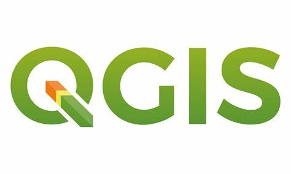

👋 Hi, I’m @Kimberley-saka,

I am a Backend developer with a background in Geographic Information Science.

Check out one of my projects: an API for a geospatial E-learning platform called <a href="https://github.com/Kimberley-saka/geobrainroom">GeoBrainRoom </a>

I am on the look out for backend development roles with a focus in python.

Tools:

 

 

